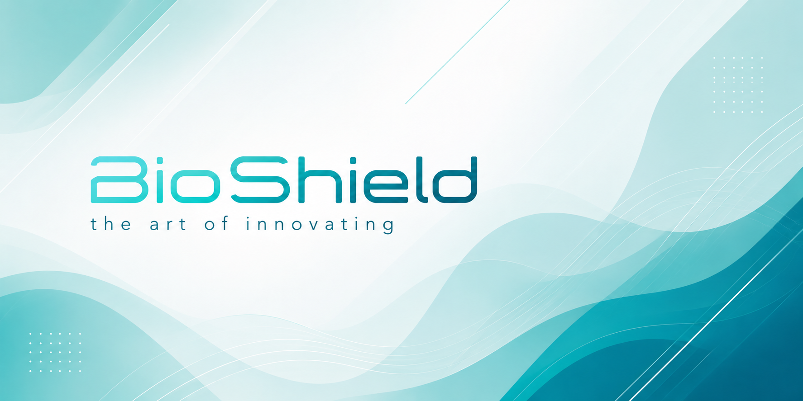

 

# `BioShield`
### the art of innovating 

 

 

---

## 🔬 Who we are

**BioShield** is a vanguard collective where academic research, green technology, and contemporary art converge. We gather the brightest scientific minds and creative rule-breakers to build technologies that empower human lives while completely redefining our relationship with the devices we use.

We don't believe in generic, mass-produced, boring tech. We operate like an avant-garde fashion house, challenging industrial homogeneity through deep philosophy and disruptive design.

 

## 🧭 The initiative

> *"Technology shouldn't just be functional, gray, and disposable. It must carry a message, provoke a reaction, and coexist harmoniously with our planet."*

Our initiative fundamentally changes how technological innovations are delivered. We work through **Series**—thematic, limited-edition drops where every single product is engineered with strict scientific purpose, crafted with green/sustainable tech, and treated as a piece of art.

Every series we build targets three goals:

- 🌱 **Green Innovation** driven by advanced academic research and bio-materials.
- 🎨 **Extravagant Aesthetics** that break the mold of traditional, sterile hardware.
- 💬 **Cultural Manifesto** using each product drop to spark a dialogue on human-tech coexistence.

 

---

## 📊 Real-time stats

  

 

---

## 🧠 Tech stack

**languages we use**

  
  

**Workspace**

  
  
  
  
  

**Tools & environments**

  
  
  

 

---

## 📡 Contact us

&nbsp;

&nbsp;

&nbsp;

&nbsp;

 

---

## 📦 Featured products

<table>
  <thead>
    <tr>
      <th>Project / Series</th>
      <th>Description</th>
      <th>Language</th>
    </tr>
  </thead>
  <tbody>
    <tr>
      <td><a href="https://github.com/bioshieldinnovations/symbiosis-core"><b>Symbiosis Core</b></a></td>
      <td>Generative design algorithms for Series 01: Creating organic, 3D-printed biomaterial structures.</td>
      <td>Python</td>
    </tr>
    <tr>
      <td><a href="https://github.com/bioshieldinnovations/eco-mesh-engine"><b>EcoMesh Engine</b></a></td>
      <td>High-performance simulation engine calculating structural integrity of living mycelium and eco-composites.</td>
      <td>C++</td>
    </tr>
    <tr>
      <td><a href="https://github.com/bioshieldinnovations/biosensing-bridge"><b>BioSensing Bridge</b></a></td>
      <td>Firmware layer connecting wearable physiological hardware to artistic, reactive data-visualizations.</td>
      <td>Python</td>
    </tr>
    <tr>
      <td><a href="https://github.com/bioshieldinnovations/manifesto-ui"><b>Manifesto UI</b></a></td>
      <td>Interactive, immersive frontend designs showcasing the philosophical narratives behind our collections.</td>
      <td>HTML5</td>
    </tr>
    <tr>
      <td><a href="https://github.com/bioshieldinnovations/sustainable-workflows"><b>Eco Workflows</b></a></td>
      <td>Optimization models evaluating environmental impact and life cycles of our experimental series.</td>
      <td>Python</td>
    </tr>
  </tbody>
</table>

 

> 💬 **More about our series** → browse all active repositories under the [Repositories](https://github.com/bioshieldinnovations?tab=repositories) tab

---

  BioShield · <i>where science meets couture</i> · github.com/bioshieldinnovations

